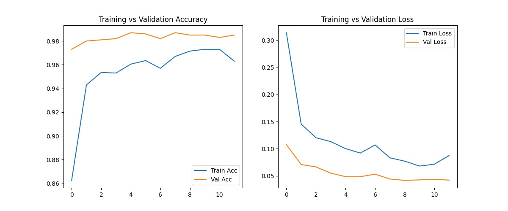

# Cats-Dogs Image Classification

This project uses a deep learning model to classify images of cats and dogs. It leverages transfer learning with the MobileNetV2 architecture, built using TensorFlow and Keras.

---
## Training Performance
The model's performance during training is shown below.



---
## Model Predictions
Here are some examples of the model predicting on new images.

**Cat Prediction:**


**Dog Prediction:**


---
## How to Use
1.  **Get the code**: Download the files from this repository.
2.  **Install dependencies**:
    ```bash
    pip install -r requirements.txt
    ```
3.  **Run the notebook**: Open and run the `project (1).ipynb` notebook in a Jupyter environment.

---
## Project Files
* **project (1).ipynb**: The main Jupyter Notebook.
* **final_image_classifier.keras**: The final trained model.
* **requirements.txt**: A list of required Python libraries.
* **training_curve.jpg**: Visual results of the training curves.
* **cat_prediction.jpg & dog_prediction.jpg**: Example prediction images.
